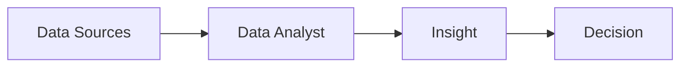

# Konvensi Penulisan Konten Markdown (`materi.md`)

> **Status:** Style guide aktif. Wajib diikuti saat menulis `materi.md` untuk modul/sesi baru.
> **Format:** ebook chapter naratif. Bukan slide bullets, bukan PPT script.

Dokumen ini menggantikan konvensi sebelumnya yang fokus pada slide PPT — yang sudah deprecated. Sekarang semua materi adalah dokumen Markdown yang dibaca langsung untuk self-paced study.

---

## 1. Filosofi Penulisan

**Asumsi:** pembaca adalah pemula yang belajar mandiri tanpa pengajar di sebelahnya. Karena itu:

- **Bahasa harus jelas, ramah, anti-intimidating.** Hindari jargon tanpa penjelasan.
- **Naratif mengalir, bukan bullet pendek-pendek.** Bullet hanya kalau memang list yang lebih efektif disampaikan sebagai list (5+ item terkait).
- **Konteks dulu, baru detail.** Mulai dengan "kenapa" sebelum "bagaimana".
- **Analogi sehari-hari konteks Indonesia.** Warung, ojol, marketplace lokal, kos, BCA, Tokopedia — bukan "imagine a baseball team".
- **Detail tapi tidak overwhelming.** Target ~3,000–5,000 kata per modul.

---

## 2. Struktur Dokumen

### Heading Hierarchy

Pakai max 3 level:

```markdown
# Pre-Week · Modul 1
# Judul Modul Lengkap                    ← H1: judul modul (bisa 2 baris)

## 1. Section Pertama                    ← H2: section utama (numbering eksplisit)

### 1.1 Subtopik dalam Section           ← H3: subtopik (numbering 1.1, 1.2, dst)
### 1.2 Subtopik berikutnya
```

**Aturan:**
- Numbering eksplisit (1, 2, 3, ...) di H2 dan (1.1, 1.2, ...) di H3 — bantu pembaca navigate
- Maksimal 3 level (H1, H2, H3). Kalau perlu lebih dalam, pakai bold paragraph saja.
- Jangan loncat level (jangan H1 → H3 tanpa H2 di antara)

### Frontmatter Modul

Setiap `materi.md` diawali dengan blockquote frontmatter:

```markdown
> **Tujuan modul:** Setelah membaca modul ini, kamu paham ...
>
> **Estimasi waktu baca:** 45–60 menit · **Format:** modul tertulis untuk dipelajari mandiri.
```

---

## 3. Gaya Bahasa

### Sapaan: pakai "kamu", bukan "Anda" atau "para peserta"

Lebih hangat & sesuai audiens millennial/Gen-Z. Tetap profesional.

✅ "Kamu akan belajar SQL dasar di Modul ini."
❌ "Para peserta diharapkan mempelajari SQL dasar dalam modul ini."

### Paragraph naratif vs bullet

✅ **Pakai paragraph** untuk konsep & penjelasan:
> "Seorang Data Analyst adalah profesional yang mengumpulkan data dari berbagai sumber, membersihkan data tersebut, menganalisis untuk menemukan pola, dan menceritakan insight ke stakeholder."

❌ **Hindari bullet pendek** untuk konsep:
> - DA mengumpulkan data
> - DA membersihkan data
> - DA menganalisis data
> - DA menceritakan insight

✅ **Pakai bullet** kalau memang list spesifik:
> Tools yang akan dipakai di Week 1:
> - Excel + Power Query
> - SQL (SQLite + BigQuery)
> - Tableau Public

### Istilah teknis: tetap English

Data Analyst, query, dashboard, pipeline, dataset, pivot, JOIN, dll — pakai English. Jangan terjemahkan paksa ("kueri", "papan informasi", dll).

### Penekanan dengan blockquote, bukan bold paragraph

Untuk callout / insight penting:

✅
```markdown
> **Pesan utama:** DA bukan tukang ngolah angka semata. DA adalah jembatan antara data mentah dan keputusan bisnis.
```

❌ jangan tulis seluruh paragraph dengan **bold** — jadi tidak nyaman dibaca.

---

## 4. Tabel

Pakai markdown table standar:

```markdown
| Aspek | Data Literacy | Data Analyst |
|---|---|---|
| Audience | Semua profesional | Khusus profesi DA |
| Skill teknikal | Excel + SQL dasar | Excel + SQL + Python + BI |
| Waktu belajar | 2–4 minggu | 3–6 bulan |
```

**Tips:**
- Maksimal 5 kolom × 8 baris supaya tetap readable.
- Kolom pertama biasanya jadi label/dimensi.
- Kalau lebih banyak baris, pertimbangkan pecah jadi 2 tabel terpisah.

---

## 5. Diagram & Gambar

### Diagram sederhana — pakai ASCII di code block

Untuk flow, hierarki, relasi sederhana — buat langsung dengan ASCII art:

````markdown
```
┌──────────────┐     ┌──────────────┐     ┌──────────────┐
│ Data Sources │ ──→ │  Data Analyst│ ──→ │   Insight    │
│              │     │              │     │              │
│  Database    │     │  Clean       │     │  Pattern     │
│  Files       │     │  Analyze     │     │  Trend       │
│  API         │     │  Visualize   │     │  Anomaly     │
└──────────────┘     └──────────────┘     └──────────────┘
```
````

**Karakter ASCII yang dipakai:**
- Box: `┌ ┐ └ ┘ ─ │`
- Connector: `─→ ←─ ─┴─ ─┬─ ─┼─`
- Bullet/icon: `•  ►  ✓  ✗  →  ⓘ`

### Gambar / screenshot — pakai placeholder

Kalau butuh screenshot dari aplikasi (VSCode, LinkedIn, dashboard tool, dll), tulis placeholder dengan **format wajib**:

```markdown
> **[GAMBAR DIPERLUKAN — Judul Singkat Gambar]**
> **Apa yang harus di-screenshot:** deskripsi spesifik. Sebut apa yang harus terlihat di gambar (misal: "halaman LinkedIn Job Search dengan keyword 'Data Analyst' filter Indonesia, tampilkan jumlah hasil di kiri atas + 3 logo perusahaan").
> **Konteks isi nanti:** kenapa gambar ini relevan, apa yang akan dijelaskan setelahnya.
```

**Aturan:**
1. Selalu pakai prefix `[GAMBAR DIPERLUKAN]` agar bisa di-grep
2. Tulis **deskripsi spesifik** (apa yang di-capture & di mana)
3. Sebut **konteks** kenapa gambar ini ada
4. Setelah gambar di-capture, ganti placeholder dengan markdown image: ``

### Mermaid diagram (opsional)

Untuk tools yang support Mermaid (GitHub, Obsidian, VSCode), boleh pakai sebagai alternatif ASCII:

````markdown

````

Tapi default tetap ASCII supaya berlaku universal.

---

## 6. Code Block

Selalu pakai language tag:

````markdown
```python
import pandas as pd
df = pd.read_csv("data.csv")
df.head()
```
````

````markdown
```sql
SELECT product_name, SUM(quantity) as total_qty
FROM transactions
GROUP BY product_name
ORDER BY total_qty DESC
LIMIT 10;
```
````

**Untuk Excel formula:**

````markdown
```excel
=VLOOKUP(A2, Sheet2!$A$1:$B$100, 2, FALSE)
```
````

---

## 7. Dataset & Latihan

### Dataset — pakai sumber free public

Untuk semua latihan analisis, pakai dataset gratis & open access:

- **Kaggle Datasets** — [kaggle.com/datasets](https://kaggle.com/datasets), butuh akun gratis
- **data.go.id** — portal data terbuka pemerintah Indonesia
- **BPS** — [bps.go.id](https://bps.go.id) — data demografi & ekonomi Indonesia
- **UCI ML Repository** — dataset klasik untuk practice
- **Mockaroo** — generator dataset palsu untuk latihan tanpa khawatir privasi

Selalu link ke dataset spesifik di `latihan/soal.md`, bukan generic "buka Kaggle".

### Latihan Excel — pakai file `.xlsx` beneran

Untuk modul Excel (Week 1):
- File `.xlsx` di folder `data/` (misal: `data/penjualan-warung-2026.xlsx`)
- File berisi data mentah yang harus dikerjakan peserta
- `latihan/soal.md` referensi ke file: "Buka `data/penjualan-warung-2026.xlsx`, lalu kerjakan ..."
- **Solusi** disimpan di file `.xlsx` terpisah (misal: `data/penjualan-warung-2026-SOLUSI.xlsx`) atau worksheet terpisah dengan password (opsional)

### Latihan SQL — pakai BigQuery / SQLite

- BigQuery sandbox untuk dataset publik (Google Analytics sample, NYC Taxi, dll)
- SQLite untuk dataset lokal yang di-load dari .csv
- File `.sql` query starter di folder `code/`

### Latihan Python — pakai Jupyter Notebook

- Notebook starter di folder `code/` (`latihan-starter.ipynb`)
- Solusi di `code/latihan-solusi.ipynb`
- Dataset di folder `data/`

---

## 8. Closing Konten

Setiap modul ditutup dengan section "**Apa Selanjutnya?**" yang berisi:
1. Tugas akhir modul (kalau ada)
2. Link ke modul berikutnya (folder mana yang harus dibuka)
3. Saran opsional untuk peserta yang ingin go deeper

Lalu footer:
```markdown
---

**Akhir Modul N · [Nama Section]**
*Savvys Education · 2026*
```

---

## 9. Checklist Sebelum Submit Modul

Sebelum modul dianggap final:

- [ ] Frontmatter blockquote ada (tujuan + estimasi waktu baca + format)
- [ ] Heading hierarchy konsisten (H1 → H2 → H3, numbering 1, 1.1, 1.2)
- [ ] Bahasa pakai "kamu" (bukan "Anda")
- [ ] Istilah teknis English tetap English
- [ ] Paragraph naratif untuk konsep, bullet untuk list
- [ ] Tidak ada `**Layout:** LX` atau metadata slide (legacy dari format PPT)
- [ ] Tabel pakai markdown standar
- [ ] Diagram sederhana → ASCII di code block
- [ ] Gambar yang butuh screenshot → placeholder format `[GAMBAR DIPERLUKAN]` dengan deskripsi spesifik
- [ ] Code block punya language tag (` ```python ` / ` ```sql `)
- [ ] Latihan referensi dataset publik (Kaggle/BPS/dll)
- [ ] Excel latihan punya file `.xlsx` di folder `data/`
- [ ] Section closing "Apa Selanjutnya?" dengan link ke modul berikutnya
- [ ] Footer signature
- [ ] Cek typo, ejaan, tanda baca

---

## 10. Anti-pattern (yang harus DIHINDARI)

❌ **Slide-style format** — `# Slide 1 — L1 Cover`, `**Layout:** L1` — sudah deprecated, jangan dipakai lagi
❌ **Bullet pendek-pendek untuk konsep** — paragraph naratif lebih baik
❌ **Bahasa formal kaku** — "Para peserta diharapkan..."
❌ **Jargon tanpa penjelasan** — "Ini adalah ETL pipeline yang OLAP-friendly" tanpa intro
❌ **Analogi non-Indonesia** — "Imagine you have a baseball team..." (peserta Indonesia tidak relate)
❌ **Tabel super besar** — pecah jadi beberapa tabel atau pakai bullet
❌ **Tanpa context** — langsung ke "cara pakai pandas" tanpa "kenapa pandas ada"
❌ **Tanpa closing** — modul harus selalu punya "Apa Selanjutnya?"

---

## Update Log

| Tanggal | Versi | Perubahan |
|---|---|---|
| 2026-04-26 | v1.0 | Versi awal — fokus konvensi slide PPT |
| 2026-04-27 | v2.0 | **Pivot:** format ganti ke ebook markdown. Semua aturan slide-style dihapus. Tambah panduan ASCII diagram, gambar placeholder, dataset Kaggle, latihan Excel `.xlsx`. |
